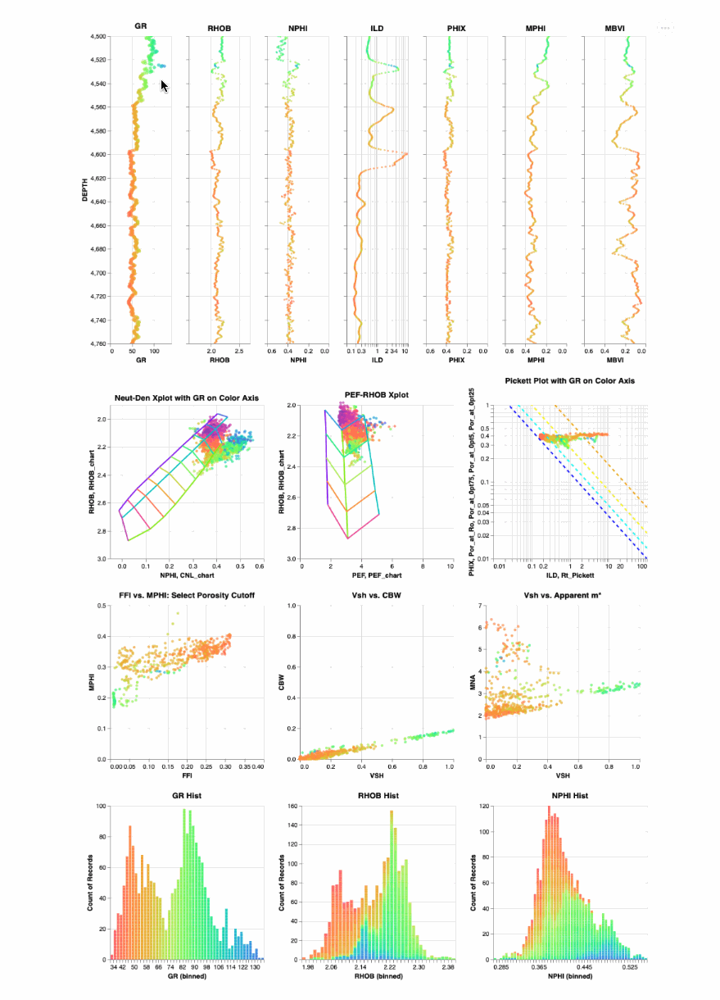

# Interrogate Petrophysical log data using Python's Interactive Altair
The objective of this project is to interrogate Petrophysical log data using python's interactive Altair. 

The following are some example results using Altair with log data where the data in depth plots, cross plots or histograms can be selected and then the appropriate data for those selected samples are shown in the other plots. 

We are still on the learning curve with Altair and have more to come. 

