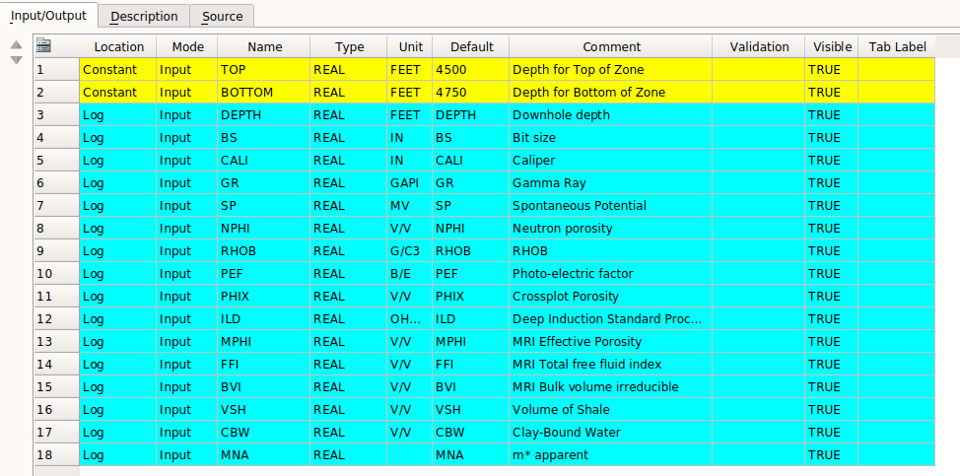

# Interrogate Petrophysical log data using Python's Interactive Altair
The objective of this repository is take advantage of Geolog's powerful python loglan capabilities to interrogate Petrophysical log data. In this example we are using python's interactive Altair in Geolog. The use of python in Geolog will allow us to employ leading-edge Data Science techniques directly in Geolog to process, interrogate and interpret our logs.

The following are some example results using Altair in a Geolog python loglan. From our Geolog well data we are can make depth plots, cross plots or histograms. Data from one plot can be selected and then the same appropriate sample data are shown for those selected samples in the other plots. 

This is just a simple example where we are only using Altair in Geolog to interrogate the well log data to better understand these data. 

This repository also contains Geolog files and subdirectories typically used in any Geolog project. The Geolog files can be loaded into a typical Geolog project format where we have loglan and data subdirectories. From the loglan subdirectory you would load the Geolog_pandas_example_altair.info loglan code and then use Module Launcher to run this program:

The top and bottom interval depths are input as constants and then Geolog loads the designated input log curves into a pandas DataFrame for processing.

We have also included a pandas_example_altair_read_las.py program to run this example outside of Geolog. We have also included a LogAnalysis_GitHub_read_las-best3_test.ipynb Jupyter Notebook to use as a tutorial.

Please let us know if you have any issues. 

